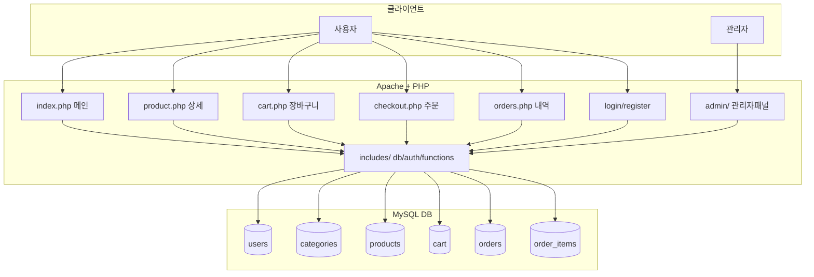

# ZorinShop - LAMP 기반 온라인 쇼핑몰

Zorin OS의 LAMP 스택(Linux + Apache + MySQL + PHP)으로 구축한 풀스택 온라인 쇼핑몰입니다.

## 기술 스택

| 구성요소 | 버전 |
|---------|------|
| OS | Zorin OS (Ubuntu 기반) |
| Apache | 2.4.58 |
| MySQL | 8.0.45 |
| PHP | 8.3.6 |
| Frontend | Bootstrap 5.3 |

## 주요 기능

- **회원 관리**: 회원가입, 로그인/로그아웃, 세션 인증
- **상품 목록**: 카테고리 필터, 검색, 상세 페이지
- **장바구니**: 추가/수량변경/삭제
- **주문**: 주문서 작성, 주문내역 조회
- **관리자 패널**: 대시보드, 상품 CRUD, 주문 상태 관리

## 설치 방법

### 1. 파일 배포
```bash
bash /home/chan/Desktop/zorin-lamp/deploy.sh
```

### 2. DB 설치
브라우저에서 접속:
```
http://localhost/shop/setup.php
```

### 3. 기본 계정
| 구분 | 이메일 | 비밀번호 |
|------|--------|---------|
| 관리자 | admin@shop.com | admin123 |
| 일반 회원 | user@shop.com | user123 |

## 접속 URL

| 페이지 | URL |
|--------|-----|
| 메인 (상품목록) | http://localhost/shop/ |
| 로그인 | http://localhost/shop/login.php |
| 관리자 | http://localhost/shop/admin/ |

## 파일 구조

```
shop/
├── index.php          - 메인 페이지 (상품 목록)
├── product.php        - 상품 상세
├── cart.php           - 장바구니
├── checkout.php       - 주문서
├── orders.php         - 주문 내역
├── login.php          - 로그인
├── register.php       - 회원가입
├── logout.php         - 로그아웃
├── setup.php          - 설치 마법사
├── setup_db.sql       - DB 스키마
├── admin/
│   ├── index.php      - 관리자 대시보드
│   ├── products.php   - 상품 관리
│   └── orders.php     - 주문 관리
├── includes/
│   ├── db.php         - DB 연결
│   ├── auth.php       - 인증 함수
│   └── functions.php  - 공통 함수
├── css/
│   └── style.css      - 커스텀 스타일
└── uploads/products/  - 상품 이미지

```

## 시스템 아키텍처



## 에러 로그

> 빌드 중 발견된 에러와 수정 내용을 기록합니다.

| 번호 | 파일 | 에러 내용 | 해결 방법 |
|------|------|-----------|-----------|
| 1 | checkout.php | bind_param() 중복 호출 (isss/isssd) | 첫 번째 잘못된 bind_param 제거 |
| 2 | admin/products.php | bind_param() 중복 호출 (issdisd/issdisi) | 잘못된 타입문자열 bind_param 제거 |
| 3 | admin/products.php | prepare()->bind_param() 체인 후 중복 prepare | 불필요한 체인 코드 제거 |
| 4 | setup.php | MySQL root auth_socket 방식으로 PHP 직접 연결 불가 (500 에러) | sudo mysql로 setup_db.sql 직접 실행 방식으로 변경 |
| 5 | setup_db.sql / db.php | MySQL 비밀번호 정책(MEDIUM) - 특수문자/대문자/숫자 필요 | 비밀번호 shop_pass123 → Shop@Pass1 로 변경 |
