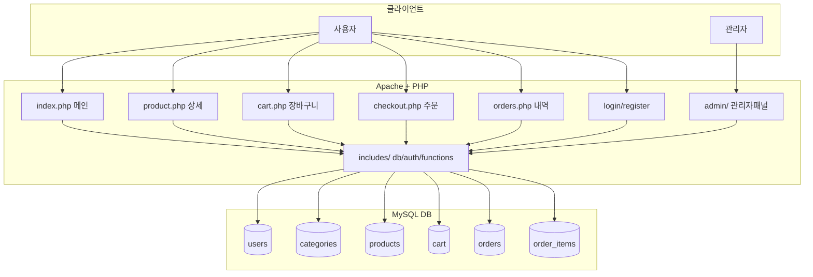

# ZorinShop - LAMP 기반 온라인 쇼핑몰

Zorin OS의 LAMP 스택(Linux + Apache + MySQL + PHP)으로 구축한 풀스택 온라인 쇼핑몰입니다.

## 기술 스택

| 구성요소 | 버전 |
|---------|------|
| OS | Zorin OS (Ubuntu 기반) |
| Apache | 2.4.58 |
| MySQL | 8.0.45 |
| PHP | 8.3.6 |
| Frontend | Bootstrap 5.3 |

## 주요 기능

- **회원 관리**: 회원가입, 로그인/로그아웃, 세션 인증
- **상품 목록**: 카테고리 필터, 검색, 상세 페이지
- **장바구니**: 추가/수량변경/삭제
- **주문**: 주문서 작성, 주문내역 조회
- **관리자 패널**: 대시보드, 상품 CRUD, 주문 상태 관리

## 설치 방법

### 1. 파일 배포
```bash
bash /home/chan/Desktop/zorin-lamp/deploy.sh
```

### 2. DB 설치
브라우저에서 접속:
```
http://localhost/shop/setup.php
```

### 3. 기본 계정
| 구분 | 이메일 | 비밀번호 |
|------|--------|---------|
| 관리자 | admin@shop.com | admin123 |
| 일반 회원 | user@shop.com | user123 |

## 접속 URL

| 페이지 | URL |
|--------|-----|
| 메인 (상품목록) | http://localhost/shop/ |
| 로그인 | http://localhost/shop/login.php |
| 관리자 | http://localhost/shop/admin/ |

## 파일 구조

```
shop/
├── index.php          - 메인 페이지 (상품 목록)
├── product.php        - 상품 상세
├── cart.php           - 장바구니
├── checkout.php       - 주문서
├── orders.php         - 주문 내역
├── login.php          - 로그인
├── register.php       - 회원가입
├── logout.php         - 로그아웃
├── setup.php          - 설치 마법사
├── setup_db.sql       - DB 스키마
├── admin/
│   ├── index.php      - 관리자 대시보드
│   ├── products.php   - 상품 관리
│   └── orders.php     - 주문 관리
├── includes/
│   ├── db.php         - DB 연결
│   ├── auth.php       - 인증 함수
│   └── functions.php  - 공통 함수
├── css/
│   └── style.css      - 커스텀 스타일
└── uploads/products/  - 상품 이미지

```

## 시스템 아키텍처



## 에러 로그

### 에러 1 - sudo 비밀번호 입력 불가
- **발생 위치**: deploy.sh 실행 시
- **에러 내용**: `sudo: a terminal is required to read the password`
- **원인**: Claude Code 환경에서 sudo 실행 시 interactive terminal이 없어 비밀번호 입력 불가
- **해결**: `sudo -S` 옵션으로 stdin을 통해 비밀번호 전달하는 방식으로 변경

---

### 에러 2 - PHP bind_param() 중복 호출
- **발생 위치**: `checkout.php` 40~41번째 줄
- **에러 내용**: 동일한 `$stmt`에 `bind_param()` 두 번 호출 (타입 문자열 `"isss"` / `"isssd"`)
- **원인**: 파라미터 타입 수정 과정에서 이전 코드를 미삭제
- **해결**: 잘못된 첫 번째 `bind_param("isss", ...)` 제거

---

### 에러 3 - PHP bind_param() 중복 호출 및 불필요한 prepare()
- **발생 위치**: `admin/products.php` 41~42번째 줄, 47번째 줄
- **에러 내용 1**: UPDATE 쿼리에서 `bind_param()` 두 번 호출 (`"issdisd"` / `"issdisi"`)
- **에러 내용 2**: `prepare()->bind_param()` 체인 후 동일 쿼리 `prepare()` 재호출
- **원인**: 코드 작성 중 타입 문자열 오기입 후 수정 과정에서 중복 발생
- **해결**: 잘못된 타입 문자열의 `bind_param` 및 중복 `prepare()` 제거

---

### 에러 4 - MySQL root 계정 PHP 직접 연결 불가 (HTTP 500)
- **발생 위치**: `setup.php` 접속 시
- **에러 내용**: `PHP Fatal error: Uncaught mysqli_sql_exception: Access denied for user 'root'@'localhost'`
- **원인**: Ubuntu/Zorin OS의 MySQL 8.0은 root 계정이 `auth_socket` 플러그인 방식으로 인증 → 비밀번호 기반 PHP 연결 불가
- **해결**: PHP setup.php 대신 `sudo mysql < setup_db.sql` 명령으로 터미널에서 직접 DB 설치

---

### 에러 5 - MySQL 비밀번호 정책 불충족
- **발생 위치**: `setup_db.sql` 실행 시
- **에러 내용**: `ERROR 1819 (HY000): Your password does not satisfy the current policy requirements`
- **원인**: MySQL `validate_password.policy = MEDIUM` 설정으로 대문자, 숫자, 특수문자 포함 필요
  - `validate_password.length` = 8
  - `validate_password.mixed_case_count` = 1
  - `validate_password.number_count` = 1
  - `validate_password.special_char_count` = 1
- **해결**: DB 사용자 비밀번호 `shop_pass123` → `Shop@Pass1` 로 변경 (db.php, setup_db.sql 동시 수정)

### 실행 영상
https://github.com/user-attachments/assets/05cdaa4e-13fa-4b56-a28e-557f753bcf01


