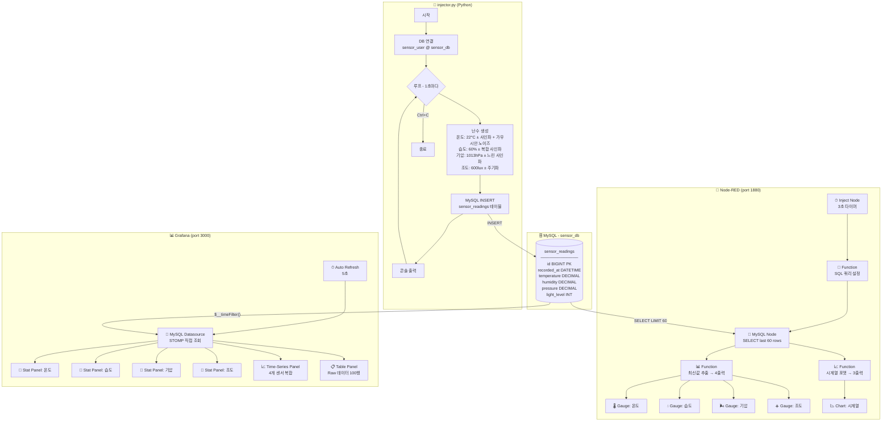
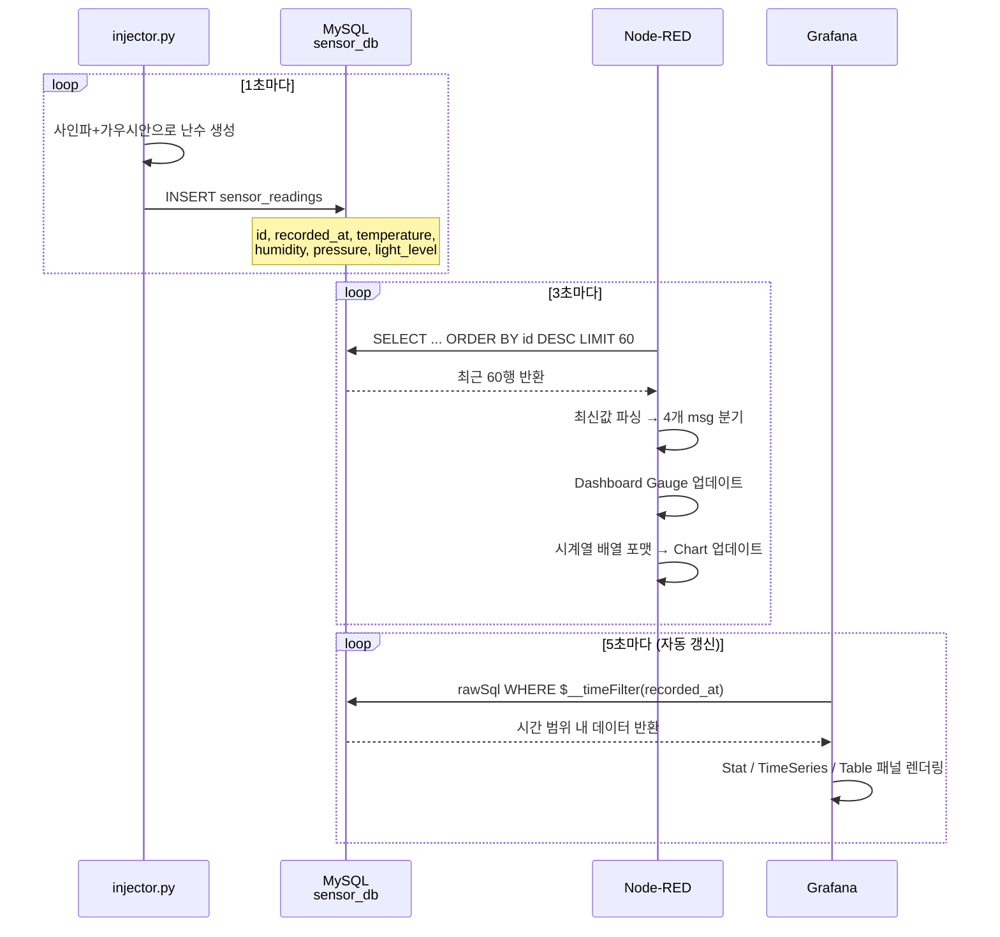

# LAMP 센서 실시간 모니터링 시스템

## 개요

Python 기반 센서 시뮬레이터(injector.py)가 1초마다 온도·습도·기압·조도 난수를 생성하여 MySQL(sensor_db)에 저장하고, Node-RED Dashboard와 Grafana가 해당 데이터를 실시간으로 시각화하는 통합 모니터링 시스템입니다.

---

## 시스템 구성 요소

| 컴포넌트 | 역할 | 주소 |
|---|---|---|
| `injector.py` | 센서 난수 생성 → MySQL 삽입 (1초 간격) | 터미널 실행 |
| MySQL `sensor_db` | 센서 데이터 영구 저장 | `localhost:3306` |
| Node-RED | 3초 폴링 → 게이지/차트 대시보드 | `http://localhost:1880/ui` |
| Grafana | MySQL 직접 조회 → 분석 대시보드 (5초 갱신) | `http://localhost:3000` |

---

## 전체 동작 Flowchart



---

## 데이터 흐름 상세



---

## 난수 생성 알고리즘

각 센서값은 **사인파 + 가우시안 노이즈** 조합으로 실제 센서처럼 자연스러운 변화를 시뮬레이션합니다.

| 센서 | 기준값 | 변화 방식 | 범위 |
|---|---|---|---|
| 온도 | 22°C | 60초 주기 사인파 ± 0.3σ 노이즈 | -10 ~ 50°C |
| 습도 | 60% | 온도 역상관 + 300초 2차 사인파 ± 1σ | 0 ~ 100% |
| 기압 | 1013.25hPa | 600초 느린 사인파 ± 0.2σ | 950 ~ 1060hPa |
| 조도 | 600lux | 120초 일출/일몰 사인파 ± 30σ | 0 ~ 2000lux |

---

## 설치 및 실행

```bash
# 1. 초기 설치 (1회만 실행)
bash setup.sh

# 2. 시스템 전체 시작
bash start.sh

# 3. 개별 실행
node-red &                  # Node-RED
sudo systemctl start grafana-server   # Grafana
python3 injector.py         # 인젝터
```

---

## 디렉토리 구조

```
randomData/
├── injector.py                          # 센서 데이터 생성 및 MySQL 삽입
├── requirements.txt                     # Python 의존성 (pymysql)
├── setup_db.sql                         # MySQL DB/테이블 스키마
├── nodered_flow.json                    # Node-RED 플로우 정의
├── nodered_cred.json                    # Node-RED DB 자격증명
├── grafana/
│   ├── provisioning/
│   │   ├── datasources/mysql.yml        # Grafana MySQL 데이터소스
│   │   └── dashboards/dashboard.yml    # 대시보드 프로바이더 설정
│   └── dashboards/
│       └── sensor_dashboard.json       # Grafana 대시보드 정의
├── setup.sh                             # 통합 설치 스크립트
├── start.sh                             # 서비스 시작 스크립트
└── project.md                           # 프로젝트 문서 (현재 파일)
```
